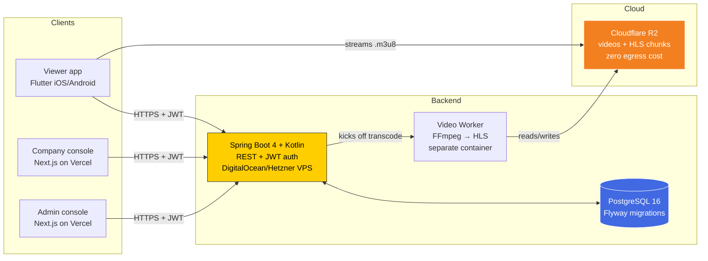
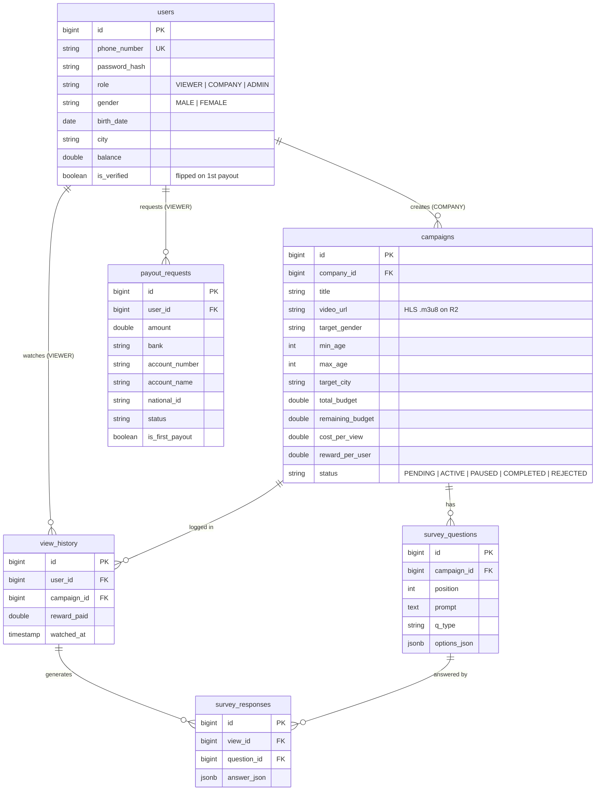

<div align="center">

# Uziy

**Targeted rewarded-video platform for the Mongolian market.**
Advertisers reach demographically-precise viewers; viewers earn tögrög for
watching an ad and completing a short survey; the platform takes a
commission on every transaction.

<p>
  <a href="#tech-stack"></a>
  <a href="#tech-stack"></a>
  <a href="#tech-stack"></a>
  <a href="#tech-stack"></a>
  <a href="#tech-stack"></a>
  <a href="#tech-stack"></a>
  <a href="#testing"></a>
  <a href="#license"></a>
</p>

</div>

---

## Table of contents

1. [What Uziy is](#what-uziy-is)
2. [How it works](#how-it-works)
3. [System architecture](#system-architecture)
4. [Tech stack](#tech-stack)
5. [Repository layout](#repository-layout)
6. [Getting started](#getting-started)
7. [API reference](#api-reference)
8. [Data model](#data-model)
9. [Core algorithms](#core-algorithms)
10. [Testing](#testing)
11. [Deployment](#deployment)
12. [Roadmap](#roadmap)
13. [Contributing](#contributing)
14. [License](#license)

---

## What Uziy is

Traditional online ads have two structural problems in Mongolia's small
market: (1) targeting is coarse — the same generic pre-roll is served to a
17-year-old student and a 45-year-old business owner, and (2) users get
nothing for their attention. Uziy fixes both.

- **Advertisers** upload a 30–120 second video, pick a precise target
  audience (age range, gender, city), attach a 2–3 question survey, and
  pay per completed view. The tighter the targeting, the higher the CPV.
- **Viewers** open the app, see only videos aimed at them, watch to the end,
  answer the survey, and receive **500–700 ₮** into their in-app wallet.
- **The platform** takes a **30–40 % commission** on every completed view
  and moderates ad content + payout requests.

The end result: advertisers reach people who actually match their target
profile, viewers get paid for real attention, and the platform earns a
transparent per-transaction fee. Survey data is a valuable secondary
product — companies can buy aggregate results on demand.

---

## How it works

<table>
<tr>
<td valign="top" width="33%">

### 👤 Viewer

1. Register with phone + age + gender + city.
2. Open the feed — see only ads matched to your profile.
3. Watch a video to completion (skipping is blocked).
4. Answer 2–3 survey questions.
5. Get 500–700 ₮ credited to your wallet.
6. Request cash-out to a bank account.

</td>
<td valign="top" width="33%">

### 🏢 Company

1. Log into the web console.
2. Upload a video, set:
   - target age range, gender, city
   - total budget
   - reward per viewer
   - 2–3 survey questions
3. Submit for moderation.
4. Once approved, campaign runs until the budget is exhausted.
5. Watch real-time analytics; export survey results.

</td>
<td valign="top" width="33%">

### 🛡️ Super Admin

1. Log into the web console.
2. Moderate incoming campaigns (approve / reject).
3. Review cash-out requests — verify bank account name matches profile.
4. On first approved payout → flag user `is_verified = TRUE` (anti-fraud).
5. Watch platform GMV, commission earned, active users.

</td>
</tr>
</table>

---

## System architecture



### Why these choices

| Component | Choice | Why |
|---|---|---|
| Video storage | **Cloudflare R2** | S3-compatible API, **zero egress fees** — a rewarded-video product is bandwidth-heavy, and R2 saves ~99 % of the bill vs S3. |
| Backend language | **Kotlin** on Spring Boot 4 | Null-safety + data classes cut boilerplate ~40 % vs Java. `@Transactional(SERIALIZABLE)` gives us the atomicity guarantee we need for reward payouts. |
| Database | **PostgreSQL 16** | Reward payouts must be atomic and race-safe. Postgres transactions, `JSONB` for survey answers, and `RETURNING` for conditional updates make this straightforward. |
| Mobile client | **Flutter** | One codebase → iOS + Android from day one; Mongolian market has both. |
| Web consoles | **Next.js 16 App Router** | Company + admin panels share auth, layout, and UI kit → one Vercel project, one deploy. |
| Auth | **JWT (HS512, 24h TTL)** | Stateless — the backend has no session store. Frontends persist the token (SecureStorage on mobile, HTTP-only cookie on web). |
| Transcoding | **FFmpeg worker** (out-of-process) | Keeps the main API responsive. Videos hit R2 as HLS `.m3u8` + `.ts` chunks in 3 quality levels (480p / 720p / 1080p). |
| Hosting | **DigitalOcean or Hetzner** | $6–$12 / month VPS is more than enough for early traffic. |

---

## Tech stack

<details>
<summary><b>Viewer app</b> — <code>viewer_app/</code></summary>

- **Flutter 3.22+**, Dart 3.4+
- Routing: **go_router 14**
- State: **flutter_riverpod 2**
- Networking: **dio 5**
- Video playback: **video_player 2** + **chewie 1** (HLS from R2)
- Storage: **flutter_secure_storage 9** for JWT
- i18n: Cyrillic Mongolian throughout; number formatting via `intl` (`mn-MN`)

</details>

<details>
<summary><b>Web consoles</b> — <code>admin_panel/</code></summary>

- **Next.js 16** (App Router, Turbopack, Server Components by default)
- **React 19**
- **TypeScript 5**
- **Tailwind CSS 4** (CSS variables for theming, matching the Flutter palette)
- **lucide-react** for icons
- One codebase, role-based routing (`/company/*` vs `/admin/*`)

</details>

<details>
<summary><b>Backend API</b> — <code>backend/</code></summary>

- **Spring Boot 4** on **Kotlin 2.3**
- **Java 17** toolchain (LTS)
- **Spring Web MVC** for REST endpoints
- **Spring Security 6** with a custom **JWT filter** (JJWT 0.12)
- **Spring Data JPA** + **Hibernate 7**
- **PostgreSQL 16** via HikariCP
- **Flyway** for schema migrations
- **Testcontainers 1.20** + **MockK 1.13** for testing (55 tests, all passing)
- **Gradle 9** with the Kotlin DSL

</details>

<details>
<summary><b>Cloud & infra</b></summary>

- **Cloudflare R2** — video storage (SigV4-compatible)
- **DigitalOcean** or **Hetzner** — API + DB hosting ($6–$12 / mo droplet)
- **Vercel** — Next.js consoles
- **Docker Compose** — local dev Postgres
- **FFmpeg** — transcoding worker (containerized)

</details>

---

## Repository layout

```
uziy/
├── README.md                  ← you are here
├── CLAUDE.md                  ← agent-oriented handoff (safe to ignore for humans)
├── docs/
│   └── SPEC.md                ← original product brief, preserved verbatim
│
├── viewer_app/                ← Flutter — viewer iOS/Android
│   ├── pubspec.yaml
│   ├── lib/
│   │   ├── main.dart
│   │   ├── app.dart
│   │   ├── theme/             AppColors + Material 3 dark theme
│   │   ├── routes/            go_router config
│   │   ├── models/            AppUser, Campaign, SurveyQuestion
│   │   ├── services/          ApiService (dio), AuthService (JWT storage)
│   │   ├── widgets/           IncentiveBanner (verbatim compliance text)
│   │   └── screens/
│   │       ├── splash / auth (login, register)
│   │       ├── home (feed, video player)
│   │       ├── survey
│   │       ├── wallet (balance, payout request)
│   │       └── profile
│   ├── android/ ios/ web/ …   platform folders
│   └── test/                  flutter_test smoke tests
│
├── admin_panel/               ← Next.js — company + admin consoles
│   ├── package.json
│   ├── app/
│   │   ├── layout.tsx         root <html lang="mn">
│   │   ├── globals.css        Tailwind + design tokens (mirror viewer_app)
│   │   ├── page.tsx           → redirects to /login
│   │   ├── login/             role picker (Company / Admin) + JWT login
│   │   ├── company/           dashboard, campaigns list, 5-step wizard,
│   │   │                      analytics, billing, settings
│   │   └── admin/             dashboard, payouts queue, users list,
│   │                          campaigns moderation, finance ledger
│   ├── components/
│   │   ├── sidebar.tsx        role-aware nav
│   │   ├── stat-card.tsx
│   │   └── ui/                Button, Card, Input, Badge
│   └── lib/
│       ├── utils.ts           cn(), formatTugrik(), relativeTime()
│       └── mock-data.ts       fixtures used until backend is wired
│
├── backend/                   ← Spring Boot — REST API
│   ├── build.gradle.kts       Boot 4, Kotlin 2.3, JJWT, MockK, Testcontainers
│   ├── docker-compose.yml     local Postgres 16 on :5432
│   ├── README.md              per-endpoint reference + env vars
│   ├── src/main/resources/
│   │   ├── application.yml    env-driven config
│   │   └── db/migration/      Flyway (V1 schema + V2 dev seed)
│   └── src/main/kotlin/mn/uziy/backend/
│       ├── UziyBackendApplication.kt
│       ├── config/            AppProperties, WebConfig
│       ├── domain/            JPA entities + Spring Data repositories
│       ├── security/          JwtService, JwtAuthFilter, SecurityConfig
│       ├── auth/              /auth/login, /auth/register/*
│       ├── viewer/            /viewer/feed, /viewer/*/submit (atomic tx)
│       ├── company/           /company/campaigns CRUD
│       ├── payout/            viewer request + admin approval
│       └── admin/             /admin/stats, users, campaigns, moderation
│
└── video_worker/              ← FFmpeg → HLS → R2  (not yet built)
```

---

## Getting started

### Prerequisites

| Tool | Minimum version | How to install (macOS) |
|---|---|---|
| **Java JDK** | 17 (LTS) | `brew install openjdk@17` |
| **Node.js** | 20 | `brew install node` (or `nvm install 20`) |
| **pnpm** | 10 | `brew install pnpm` (or `npm i -g pnpm`) |
| **Flutter** | 3.22 | `brew install --cask flutter` |
| **Docker Desktop** | 28 | download from [docker.com](https://docker.com) |
| **Xcode** (iOS) | 26 | Mac App Store |

Verify with `flutter doctor` and `docker info`.

### Run the whole stack in three terminals

**Terminal 1 — Backend + Postgres**

```bash
cd backend
docker compose up -d postgres          # boots Postgres 16 on :5432
./gradlew bootRun                      # migrations run automatically
# API up on http://localhost:8080
```

**Terminal 2 — Admin + Company console**

```bash
cd admin_panel
pnpm install
pnpm dev
# open http://localhost:3000 → pick "Компани" or "Супер Админ"
```

**Terminal 3 — Viewer app**

```bash
cd viewer_app
flutter pub get
open -a Simulator                      # iOS Simulator
flutter run
# or physical device:
# flutter run -d <device-id>
```

### Smoke-test the reward flow with curl

```bash
# 1. Register a viewer
TOKEN=$(curl -sS -X POST http://localhost:8080/auth/register/viewer \
  -H "Content-Type: application/json" \
  -d '{"phoneNumber":"77000001","password":"password1",
       "gender":"MALE","birthDate":"2000-01-01","city":"Улаанбаатар"}' \
  | jq -r .token)

# 2. Get the feed (should return 1 seeded campaign)
curl -sS http://localhost:8080/viewer/feed \
  -H "Authorization: Bearer $TOKEN" | jq

# 3. Submit the survey — earns 700 ₮
curl -sS -X POST http://localhost:8080/viewer/campaigns/1/submit \
  -H "Authorization: Bearer $TOKEN" \
  -H "Content-Type: application/json" \
  -d '{"answers":[{"questionId":1,"answerJson":"\"Тийм\""}]}' | jq

# 4. Confirm balance
curl -sS http://localhost:8080/viewer/me \
  -H "Authorization: Bearer $TOKEN" | jq .balance
```

---

## API reference

Full endpoint reference lives in [`backend/README.md`](backend/README.md).
Summary:

| Method + Path | Role | Purpose |
|---|---|---|
| `POST /auth/login` | anonymous | Issue JWT |
| `POST /auth/register/viewer` | anonymous | Create viewer + JWT |
| `POST /auth/register/company` | anonymous | Create company + JWT |
| `GET  /viewer/me` | VIEWER | Current profile + balance |
| `GET  /viewer/feed` | VIEWER | Targeted campaigns (age/gender/city, not yet watched) |
| `GET  /viewer/campaigns/{id}/questions` | VIEWER | Survey for a campaign |
| `POST /viewer/campaigns/{id}/submit` | VIEWER | **Atomic reward transaction** — credit balance, decrement budget, record view |
| `POST /viewer/payouts` | VIEWER | Cash-out request (reserves balance) |
| `GET  /viewer/payouts` | VIEWER | Own payout history |
| `GET  /company/campaigns` | COMPANY | Own campaigns |
| `POST /company/campaigns` | COMPANY | Create campaign + survey |
| `PATCH /company/campaigns/{id}/status` | COMPANY | Pause / resume / end |
| `GET  /admin/stats` | ADMIN | Platform-wide counters |
| `GET  /admin/users` | ADMIN | All users |
| `PATCH /admin/users/{id}/verify` | ADMIN | Set `is_verified = TRUE` |
| `GET  /admin/campaigns?status=PENDING` | ADMIN | Moderation queue |
| `PATCH /admin/campaigns/{id}/moderate` | ADMIN | Approve / reject a campaign |
| `GET  /admin/payouts` | ADMIN | Pending cash-out requests |
| `PATCH /admin/payouts/{id}/decision` | ADMIN | Approve / reject; first approval flips `is_verified = TRUE` |

---

## Data model

Five core tables, all foreign-keyed to `users`:



Full DDL with indexes, constraints (`reward < cost`, `min_age ≤ max_age`,
etc.) and dev seed lives in
`backend/src/main/resources/db/migration/`.

---

## Core algorithms

### 1. Incentivized profiling

On registration, viewers see this exact message (in Cyrillic Mongolian):

> 💡 Та өөрийн нас, хүйс, байршлыг үнэн зөв оруулснаар өөрт тохирсон илүү
> олон, илүү өндөр дүнтэй видео судалгаануудыг хүлээн авч, орлогоо
> нэмэгдүүлэх боломжтой болно.

Honesty is enforced at the **first payout**: the admin checks that the bank
account name and national ID match the profile data. On match, `is_verified`
is set to `TRUE`. Fake profiles never reach cash.

### 2. Targeted home feed

The feed only returns campaigns the viewer hasn't seen, matching all
demographic filters, with enough remaining budget:

```sql
SELECT c.* FROM campaigns c
WHERE (c.target_gender = 'ALL' OR c.target_gender = :user_gender)
  AND (:user_age BETWEEN c.min_age AND c.max_age)
  AND (c.target_city = 'ALL' OR c.target_city = :user_city)
  AND c.remaining_budget >= c.cost_per_view
  AND c.status = 'ACTIVE'
  AND c.id NOT IN (
      SELECT video_id FROM view_history WHERE user_id = :user_id
  );
```

### 3. Atomic reward transaction

The most safety-critical piece. When a viewer submits a survey, the backend
runs this inside a **`SERIALIZABLE`** transaction:

1. Verify the user hasn't been rewarded for this campaign
   (`view_history` unique constraint `(user_id, campaign_id)`).
2. **Conditional** UPDATE on the campaign:
   `remaining_budget = remaining_budget - cost_per_view`
   `WHERE id = ? AND status = 'ACTIVE' AND remaining_budget >= cost_per_view`.
   The row count tells us whether we won the race.
3. Insert `view_history` and per-question `survey_responses`.
4. Credit `users.balance += reward_per_user`.

If any step fails, everything rolls back — no partial reward, no
double-payout. This is exercised end-to-end by
`AtomicRewardIntegrationTest` against a real Postgres in Testcontainers.

### 4. HLS transcoding pipeline

```
Company uploads .mp4
         │
         ▼
   Video Worker container  (separate process, doesn't block the API)
         │
         ├── FFmpeg → 480p / 720p / 1080p
         ├── Segment into 2–3 s .ts chunks
         └── Generate .m3u8 master playlist
         │
         ▼
   Cloudflare R2 (zero egress fees)
         │
         ▼
   Viewer app streams via video_player
```

---

## Testing

The backend has **55 tests across 8 classes**, run with `./gradlew test`:

| Suite | Tests | Purpose |
|---|---|---|
| `AuthControllerTest` | 7 | login OK / 401 cases, register-viewer/company OK / 409 |
| `ViewerControllerTest` | 9 | feed filtering, questions, submit (happy + duplicate + race + not-found) |
| `CompanyControllerTest` | 9 | list, get + 403, create + `reward < cost` guard, status transitions |
| `PayoutControllerTest` | 10 | request (reserves balance) + insufficient + first-payout flag; admin approve / reject / 409 |
| `AdminControllerTest` | 9 | stats aggregation, verify, moderation (approve / reject / 400 / 409) |
| `JwtServiceTest` | 4 | round-trip, tampered secret detection, role claim extraction |
| `UserEntityTest` | 4 | `age` getter (null, birthday passed / today / not yet) |
| `AtomicRewardIntegrationTest` | 3 | Testcontainers Postgres — reward tx, duplicate reject, budget-exhausted rollback |

Controller tests are pure JUnit + MockK (millisecond-fast, no Spring
context). The integration test boots Spring against a real Postgres 16 in
Docker via Testcontainers and asserts the SERIALIZABLE reward transaction
holds under real DB semantics.

```bash
cd backend
./gradlew test                     # runs all 55
./gradlew test --tests '*Auth*'    # single suite
```

Frontend tests are not yet written — planned in the roadmap.

---

## Deployment

### Backend (Spring Boot)

Recommended: **DigitalOcean droplet** ($6/mo, 1 GB RAM) or **Hetzner CX22**
($4/mo, 4 GB RAM).

```bash
# On the server
./gradlew bootJar
scp build/libs/backend-*.jar user@server:/opt/uziy/
# systemd unit runs: java -jar /opt/uziy/backend-*.jar
```

Env vars (`DB_URL`, `DB_USER`, `DB_PASSWORD`, `JWT_SECRET`, `PORT`) are
injected via systemd `EnvironmentFile=`.

### Web consoles (Next.js)

Deploy to **Vercel** — the `admin_panel/` directory is a standard
Next.js project.

```bash
cd admin_panel
vercel deploy --prod
```

Set `NEXT_PUBLIC_API_BASE_URL=https://api.uziy.mn` in Vercel env vars.

### Viewer app

- **iOS**: Xcode → Product → Archive → distribute via App Store Connect.
- **Android**: `flutter build appbundle --release` → upload to Play Console.

### Video storage

Cloudflare R2 bucket + one S3-compatible access key. The video worker uses
that key to upload transcoded HLS chunks; the viewer streams from the
public R2 URL.

---

## Roadmap

**Shipped**
- [x] Flutter viewer app UI (auth, feed, video player, survey wizard, wallet, profile)
- [x] Next.js console (company panel, admin panel, role-based routing)
- [x] Spring Boot backend (auth, feed, atomic reward tx, campaigns, payouts, moderation)
- [x] PostgreSQL schema + Flyway migrations + dev seed
- [x] 55 backend tests including Testcontainers integration proof of atomicity
- [x] JWT auth + role-based access on all three surfaces

**Next up**
- [ ] Video worker (FFmpeg → HLS → R2) — currently a stub; campaigns accept a
      pre-hosted `videoUrl` string
- [ ] Wire the two frontends to the real backend (they currently use mock data)
- [ ] Real BCrypt hashes in `V2__seed_dev_data.sql` so seed users can log in
- [ ] `./gradlew makeAdmin --phone=XXX` bootstrap command
- [ ] Widget / Vitest tests for the frontends
- [ ] Push notifications for new campaign availability
- [ ] Real bank-transfer integration for payouts (currently manual)

**Later**
- [ ] Company self-service billing (Stripe / QPay top-up)
- [ ] Company API for programmatic campaign creation
- [ ] Analytics dashboards (Grafana) for platform ops
- [ ] Fraud detection (VPN detection, click-farm signals)
- [ ] Loyalty / referral bonuses for viewers

---

## Contributing

This is a private project, but the internal contribution flow is:

1. Branch off `main`.
2. Add tests for any new function / endpoint / non-trivial logic. Backend
   uses JUnit 5 + MockK + Testcontainers; Flutter uses `flutter_test`;
   Next.js will use Vitest.
3. Run **all three test suites** before opening a PR:
   ```bash
   ( cd backend      && ./gradlew test )
   ( cd viewer_app   && flutter test )
   ( cd admin_panel  && pnpm test 2>/dev/null || echo "no tests yet" )
   ```
4. Update `docs/SPEC.md` if the change touches the product model.
5. Open a PR to `main`.

---

## License

Proprietary — © 2026 Uziy. All rights reserved.
For commercial licensing enquiries: **support@uziy.mn**.
